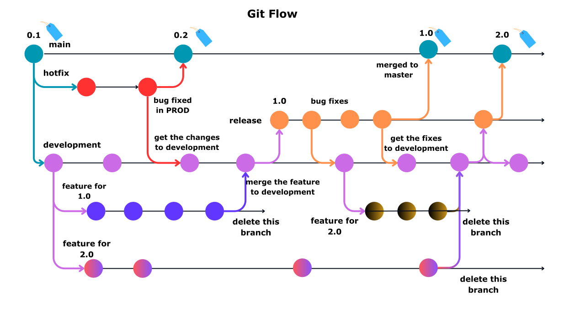
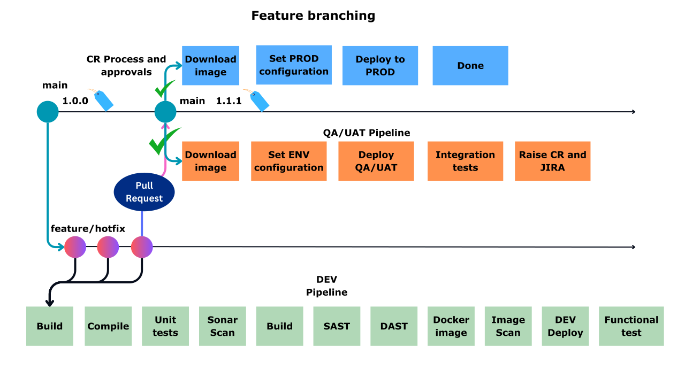

# Branching Strategy

A well-defined branching strategy is crucial for maintaining a clean, organized, and manageable codebase.

Here are some key reasons why having a branching strategy is important:
* Parallel Development
* Code Stability
* Code Reviews and Collaboration
* CICD

There are 3 popular branching strategies.

* Git flow
* Feature branching
* Trunk based

**Git Flow:**

main(long lived) branches --> main, development

* hotfix branch:
source: main
destination:  main, development

* development branch
source: main
destination: nothing

* feature branch
source: development
destination: development

* release branch
source: development
destination: main, development

hotfix
--------
Hotfix is an emergency bug. may be p0 or p1 priority which needs immediate attention and SLA is small.
a small change in code may sometimes fix the issue. so team creates hotfix branches make change and merge it to main branch and deploy which is not recommended.

General flow if there is a change is 
-------------------------------------
Deploy to DEV ----> and test in DEV---> send to QA ---- do QA test ---> send to UAT ---> do UAT test---> some goes to PR-PROD ----> and do regression testing (changes made did not affect other functionality), sanity testing ---> send to PROD. (this may take atleast 1 week time)

Earlier we used this git flow model.

**Feature branching model/Git hub flow**

In this type of branching one person works on one branch/feature --> can follow either rebase/ merge

we have one release for every 2 weeks, we follow feature branching
main --> Production
feature branch from main branch
they do the development and deploy to DEV environment
if that is success, they will raise PR, if the PR is approve they merge changes to main branch.
then we perform QA and UAT deployment.
once we get QA and UAT sign off, we will deploy to PROD through CR process.

CR --> change request process
what are the changes in the release
what is the date and time of release
if failure, how can we rollback? what is the plan?
any downtime? --> yes/no
QA testing
UAT testing
Scans
Delivery manager from TCS
QA manager
Client approval

deployment window --> 10-JUN-2024 03:00-04:00 AM

deployment failed, CR failed

why it is failed, stop the next sprint

RCA --> Root cause analysis